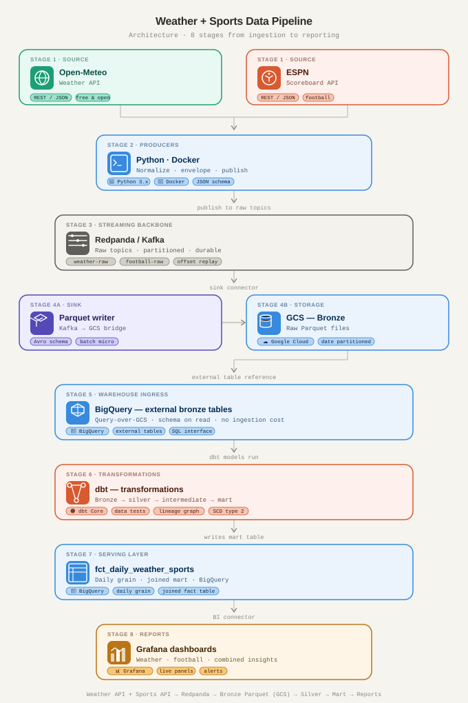
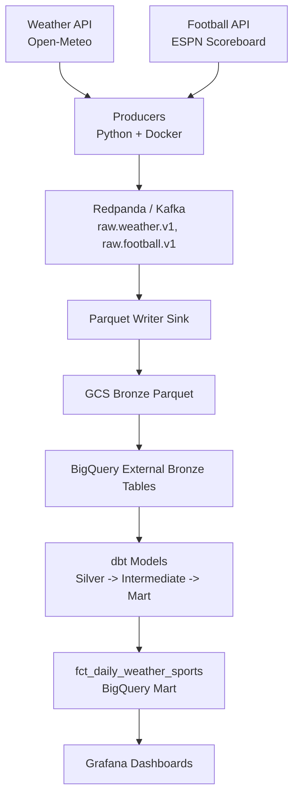

# Event Fusion: Weather x Football Streaming Analytics

Event Fusion is an end-to-end data engineering project that joins daily weather conditions with football activity to create analytics-ready datasets and dashboards.

It is built as a practical, production-style pipeline: stream ingestion, raw persistence, warehouse modeling, data quality checks, and BI reporting.


## Why This Project

Weather affects fan behavior, match dynamics, and broader sports engagement.  
This project answers questions such as:

- How do weather patterns correlate with goal volume or match outcomes by league/day?
- Which countries or leagues are more weather-sensitive?
- How can we operationalize this in a repeatable, testable analytics pipeline?

## Architecture

`Weather API + Football API -> Redpanda -> Bronze Parquet (GCS) -> BigQuery External Tables -> dbt (Silver/Intermediate/Mart) -> Grafana`





## Key Features

- Dual-source ingestion from weather and football APIs.
- Contract-aware producers with schema version, retry/backoff, DLQ routing, and deduplication.
- Streaming backbone with Redpanda topic bootstrap and retention policies.
- Bronze data persisted in partitioned Parquet on GCS.
- dbt layers (`silver`, `intermediate`, `marts`) with tests.
- Grafana dashboards provisioned from code.

## Project Structure

```text
event-fusion/
├── src/
│   ├── producers/
│   │   ├── common.py
│   │   ├── weather_producer.py
│   │   ├── football_producer.py
│   │   └── sources.json
│   └── sinks/
│       └── kafka_to_gcs_parquet.py
├── analytics_dbt/
│   ├── models/
│   │   ├── silver/
│   │   ├── intermediate/
│   │   └── marts/
│   ├── scripts/
│   │   └── create_bronze_external_tables.py
│   └── dbt_project.yml
├── grafana/
│   ├── dashboards/
│   └── provisioning/
├── docker/
├── docker-compose.yml
├── .env.example
└── README.md
```

## Tech Stack

| Layer | Tooling | Responsibility |
|---|---|---|
| Ingestion | Python producers | Pull weather and football events |
| Streaming | Redpanda (Kafka API) | Durable topic transport |
| Stream processing/runtime | Flink (services included) | Real-time compute runtime (extensible) |
| Raw storage | GCS + Parquet | Bronze historical storage |
| Warehouse | BigQuery | Query engine + external tables |
| Transformations | dbt | Silver/intermediate/mart modeling |
| BI | Grafana | Dashboards and analysis |
| Orchestration | Docker Compose | Local environment lifecycle |

## Quick Start (Local)

### 1) Prerequisites

- Docker + Docker Compose
- Google Cloud project with BigQuery and GCS enabled
- Service account key with dataset/bucket access
- Optional: `gcloud` CLI for validation commands

### 2) Clone and configure

```bash
git clone https://github.com/winbalf/event-fusion
cd event-fusion
cp .env.example .env
mkdir -p keys
```

Add your GCP service account key at:

- `keys/gcs.json`

Set values in `.env`:

- `GCP_PROJECT_ID`
- `GCS_BUCKET`
- `BIGQUERY_DATASET`
- `HISTORY_START_DATE`
- `HISTORY_END_DATE`
- `HISTORICAL_RUN_ONCE` (optional: set `true` to run one historical pass and exit producers)
- `PRODUCER_RESTART_POLICY` (optional: set `no` when using run-once mode)

### 3) Build and run

```bash
docker compose build weather-producer football-producer parquet-writer
docker compose up -d
```

### 4) Validate ingestion

```bash
docker compose logs -f weather-producer football-producer parquet-writer
gcloud storage ls "gs://$GCS_BUCKET/bronze/**"
```

### 5) Build warehouse models (dbt)

```bash
docker compose exec -T dbt python /usr/app/scripts/create_bronze_external_tables.py
docker compose exec -T dbt dbt run --select stg_weather stg_football int_daily_weather int_daily_football fct_daily_weather_sports
docker compose exec -T dbt dbt test --select stg_weather stg_football int_daily_weather int_daily_football fct_daily_weather_sports
```

### 6) Open Grafana

- URL: `http://localhost:3000`
- User: `admin`
- Password: `admin`

Provisioned dashboards:

- `weather-trends`
- `football-performance`
- `weather-vs-sports`

## Data Model Overview

### Silver Layer

- `stg_weather`: typed weather records from bronze JSON payloads.
- `stg_football`: typed football records from bronze JSON payloads.

### Intermediate Layer

- `int_daily_weather`: daily weather aggregates by `date_day`, `country`, `city`.
- `int_daily_football`: daily football aggregates by `date_day`, `country`, `league_code`.

### Mart Layer

- `fct_daily_weather_sports`: daily joined fact table by date/country/league.

This mart is partitioned and clustered for dashboard-friendly query patterns.

## Data Quality and Reliability

Implemented now:

- Contract validation at producer side.
- Retry with exponential backoff.
- Dead-letter topics for failed events.
- In-memory dedup keys for publish safety.
- dbt tests (`not_null`, `unique` in core paths).

Planned next:

- Stronger semantic tests (`accepted_values`, `relationships`, range checks).
- Freshness SLAs and late-arrival tracking.
- Metrics export to Prometheus/OpenTelemetry.

## Monitoring and Operations

Useful commands:

```bash
docker compose ps
docker compose logs -f redpanda redpanda-init
docker compose logs -f weather-producer football-producer parquet-writer
```

Stop stack:

```bash
docker compose down
```

Full local reset:

```bash
docker compose down -v
```

## Roadmap

- Add CI pipeline (linting, tests, compose validation).
- Add environment profiles (`dev`, `staging`, `prod`).
- Harden secrets strategy (non-file based for non-dev environments).
- Add anomaly alerts in Grafana for pipeline and data quality signals.
- Document dbt lineage and publish docs artifacts.

## Security Notes

- Keep `keys/gcs.json` local only.
- Never commit `.env` or key files.
- Prefer least-privilege IAM at bucket/dataset scope instead of project-wide roles.
